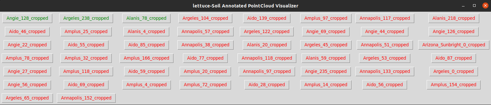

# Lettuce/Soil Annotated PointCloud Visualizer

`python3 main.py --dir_path='${PATH_TO_DIR}'`
- `${PATH_TO_DIR}` is the path to the directory that contains `.ply` (pointcloud) and `.npy` (labels) files.

 

    
 

  

    
 

